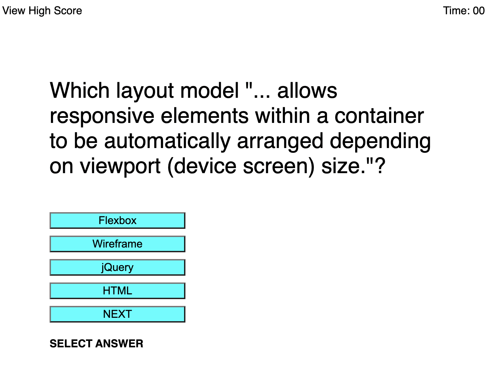

# Project Title

Module 4 Challenge

## Description

This is the fourth project in the University of Texas
at Austin Coding Bootcamp.  In this project, students have been
tasked with creating code to run a quiz in a browser.  The quiz
has a timer and the user loses time if they miss a question.
When the user finishes the quiz or runs out of time, whichever
happens first, the game ends and the user's score is entered 
into a high score list.  The user is able to view the high
score list and clear it.

## Screenshot

## Links

<a href="">Link to Deployed Page</a>

<a href="">Link to Github Page with Code</a>

## Author

Skipper Thurman

email: slthurman01@gmail.com

<a href="https://github.com/skip-thurm">Personal Github Page</a>